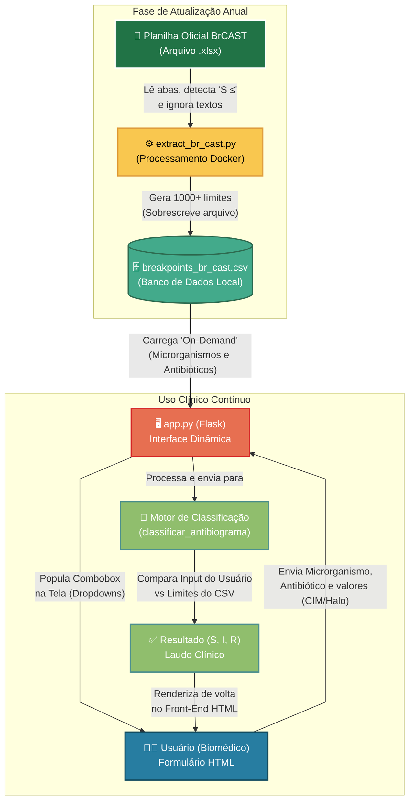

# Antibiograma App

Este projeto é uma aplicação web desenvolvida em **Python (Flask)** com o objetivo de auxiliar profissionais da saúde na interpretação de resultados de testes de sensibilidade aos antimicrobianos (antibiogramas) pelo método de disco-difusão. 

A aplicação automatiza a classificação dos resultados baseando-se nas diretrizes oficiais e atualizadas do **BrCAST** (Comitê Brasileiro de Teste de Sensibilidade aos Antimicrobianos) / EUCAST.

## 🎯 Objetivo Principal

O principal objetivo desta aplicação é fornecer uma interface rápida e intuitiva para classificar o diâmetro do halo de inibição (medido em milímetros) de uma cultura bacteriana em categorias clínicas padronizadas:
- **S** – Sensível, dose padrão
- **I** – Sensível, aumentando exposição
- **R** – Resistente

Isso reduz a necessidade de consulta manual e demorada a grandes tabelas em PDF ou planilhas de Excel, minimizando erros e agilizando a tomada de decisão clínica.

## ⚙️ Como o projeto funciona

A aplicação é dividida em dois eixos principais:

1. **Interface Web (`app.py` & `templates/index.html`):** 
   A aplicação utiliza o framework Flask para renderizar a página web e lidar com as requisições do usuário. Ela permite que o usuário selecione o microrganismo, o antibiótico e insira a medida do halo.
2. **Processamento de Dados (Pandas):** 
   Para obter os pontos de corte dinamicamente, o sistema lê e analisa a planilha oficial do BrCAST (`Tabela-pontos-de-corte-clinico-BrCAST-01-02-2025.xlsx`) utilizando a biblioteca `pandas`. Ele busca a aba correspondente ao microrganismo, encontra o antibiótico e processa as regras de limite (`>=`, `<`, intervalos, etc.) para comparar com o diâmetro inserido pelo usuário.

> **Nota:** Há também um script utilitário secundário (`extract_br_cast.py`) que usa a biblioteca `tabula` para tentar extrair tabelas do documento em PDF, caso seja necessário gerar arquivos CSV. No entanto, o aplicativo principal consome os dados de forma mais robusta diretamente do Excel.

---

## 🚀 Como executar o projeto

O projeto possui suporte total a contêineres utilizando **Docker** e **Docker Compose**. Isso elimina a necessidade de instalar Python, Java e dependências diretamente na sua máquina local, evitando problemas de configuração.

### Subir a aplicação
No diretório raiz (onde estão o `Dockerfile` e o `docker-compose.yml`), execute o comando abaixo no seu terminal:
```bash
docker compose up -d
```
Após o build inicial (que instalará todas as bibliotecas), a aplicação ficará disponível automaticamente no navegador em: **[http://127.0.0.1:5000](http://127.0.0.1:5000)**

*(Para parar e remover os contêineres, use o comando `docker compose down`)*

---

## 🧪 Como realizar testes com dados reais

Para testar a ferramenta na prática, você pode simular um laudo laboratorial de antibiograma:

1. **Abra a aplicação** no navegador (`http://127.0.0.1:5000`).
2. **Selecione o Microrganismo**: Por exemplo, escolha `Pseudomonas aeruginosa` ou `Enterobacterales` na primeira caixa de seleção.
   *(A página fará uma rápida recarga para atualizar a lista de antibióticos apropriada para a bactéria escolhida).*
3. **Selecione o Antibiótico**: Escolha um antimicrobiano da lista que deseja avaliar, por exemplo, `Cefepime` ou `Meropenem`.
4. **Insira o Diâmetro Medido**: Digite o tamanho do halo de inibição (em milímetros) que foi lido na placa de Petri. Por exemplo, digite `19`.
5. **Classificar**: Clique no botão "Classificar".
6. **Resultado**: O sistema fará o cruzamento com a tabela BrCAST e exibirá abaixo do botão uma mensagem indicando se o resultado é Sensível (S), Sensível aumentando exposição (I) ou Resistente (R).

*Exemplo prático:* 
Se você escolher `Pseudomonas aeruginosa` e o antibiótico `Ciprofloxacin`, ao inserir o diâmetro `25`, a aplicação verificará os pontos de corte na tabela Excel do BrCAST e lhe dará a resposta baseada nesses parâmetros oficias.

---

## 🛠 Testes Unitários

O projeto inclui um conjunto de testes unitários para garantir que tanto o processamento das tabelas (extração) quanto a lógica de classificação dos halos de antibiograma estejam funcionando perfeitamente. Foram testados cenários de Sensível (S), Aumentando Exposição (I) e Resistente (R).

### Como executar os testes

Com o contêiner da aplicação em execução (`docker compose up -d`), você pode rodar os testes diretamente por ele usando o comando:
```bash
docker compose exec app python -m unittest test_antibiograma.py
```
O terminal deverá retornar um "OK" informando que todos os testes foram executados com sucesso (por exemplo, `Ran 5 tests in 0.013s`).

---

## 🔄 Como atualizar os dados (Regerar CSV)

Todo ano, novos documentos de diretrizes são lançados. Caso você baixe o novo arquivo Excel oficial (`.xlsx`) e precise regerar o `breakpoints_br_cast.csv`, basta utilizar o ambiente Docker.

Com o seu contêiner da aplicação já rodando, execute:
```bash
docker compose exec app python extract_br_cast.py
```
> **Nota de Alta Performance:** Anteriormente o script tentava extrair de forma imprecisa a partir do PDF usando Tabula (podendo demorar minutos e perder dados). O script foi 100% reescrito para ler instantaneamente os dados estruturados da planilha oficial (`.xlsx`) do BrCAST presente no diretório. O processo agora leva menos de 2 segundos e extrai a totalidade absoluta dos microrganismos mapeados!

## 🧩 Fluxo de Arquitetura da Aplicação

O diagrama abaixo ilustra como os dados transitam do momento da extração anual até o uso médico diário na classificação de antibiogramas.


